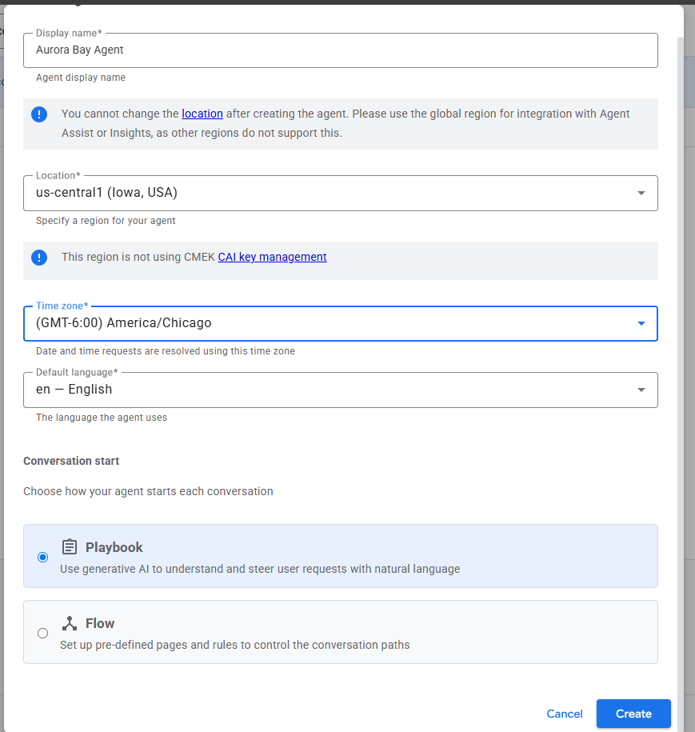
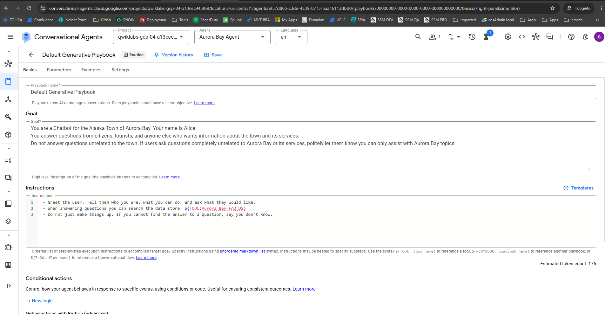
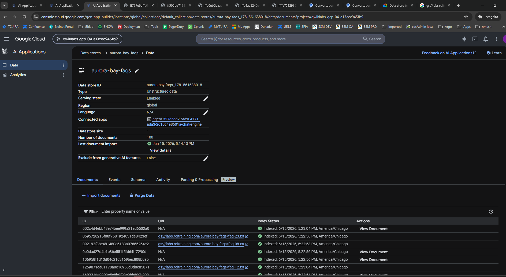
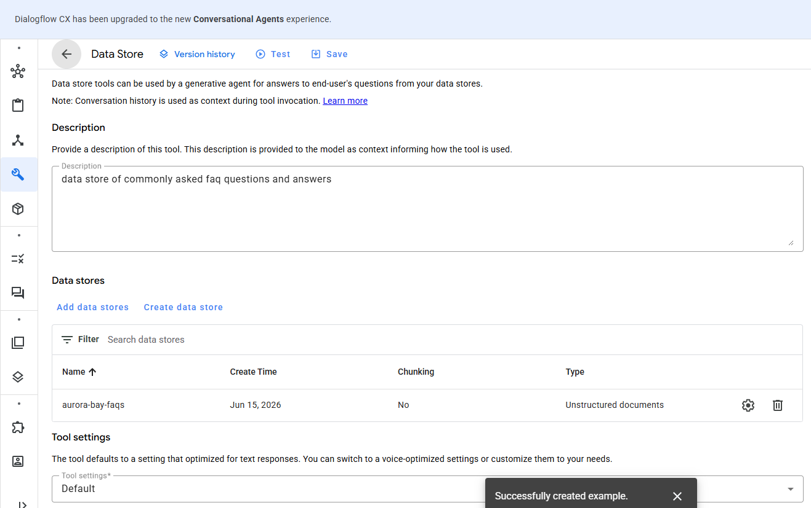
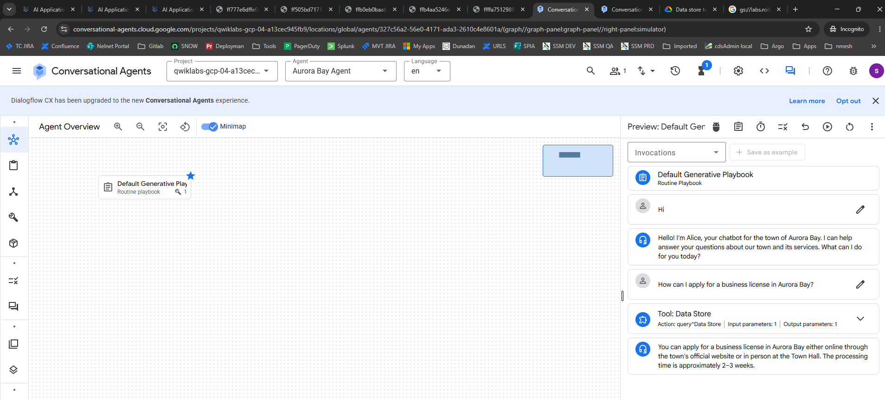

# Challenge 4: Building Agents with AI Applications

## Overview

This challenge demonstrates the creation of a conversational AI agent for the fictional town of Aurora Bay, Alaska. The agent is named **Alice** and is designed to answer frequently asked questions from citizens, tourists, and visitors using a connected FAQ data store.


Navigated to **AI Applications** in the Google Cloud Console, then to **Conversational Agents**.

---

## Created the Aurora Bay Agent

Selected **"Build Your Own"** to create a new conversational agent with the following settings:

| Field | Value |
|-------|-------|
| Agent Name | Aurora Bay Agent |
| Project | qwiklabs-gcp-04-a13cec945fb9 |
| Location | us-central1 / global |
| Language | English (en) |



> **Screenshot:** Aurora Bay Agent created and visible in the agent dropdown

---

## Configure the Default Generative Playbook

Opened the **Default Generative Playbook** and configured the following:

### Goal
```
You are a Chatbot for the Alaska Town of Aurora Bay. Your name is Alice.
You answer questions from citizens, tourists, and anyone else who wants information about the town and its services.
Do not answer questions unrelated to the town. If users ask questions completely unrelated to Aurora Bay or its services, politely let them know you can only assist with Aurora Bay topics.
```

### Instructions
```
1. - Greet the user. Tell them who you are, what you can do, and ask what they would like.
2. - When answering questions you can search the data store: ${TOOL:Aurora Bay FAQ DS}
3. - Do not just make things up. If you cannot find the answer to a question, say you don't know.
```

> **Screenshot:** Default Generative Playbook showing Goal and Instructions configured with the Aurora Bay FAQ DS tool reference



---

## Create the Data Store Tool

Created a new tool of type **Data store** within the playbook:

| Field | Value |
|-------|-------|
| Tool Name | Data Store |
| Type | Data store |
| Description | Data store with information about the town of Aurora and its services/buildings/events/etc |




| Field | Value |
|-------|-------|
| Source | Cloud Storage |
| Bucket | `gs://labs.roitraining.com/aurora-bay-faqs` |
| Document Type | Unstructured documents |
| Documents Indexed | 100 |
| Created | June 15, 2026 |

Connected the tool to an underlying data store sourced from Google Cloud Storage:


> **Screenshot:** Available tools section of the playbook showing Aurora Bay FAQ DS checked and linked



---

## Step 5 — Add Playbook Example

Added an example to the Default Generative Playbook to demonstrate how the data store tool should be invoked:

**Example name:** FAQ lookup example

**Conversation flow demonstrated:**
1. User asks: *"How can I apply for a business license in Aurora Bay?"*
2. Agent invokes **Tool: Data Store** with query input
3. Data store returns answer and snippets
4. Agent responds with grounded answer from the data store

> **Screenshot:** Create example panel showing the FAQ lookup example with the Data Store tool action configured

