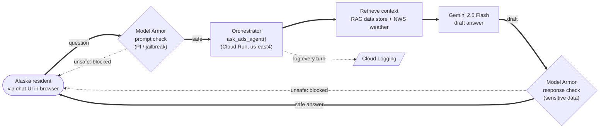
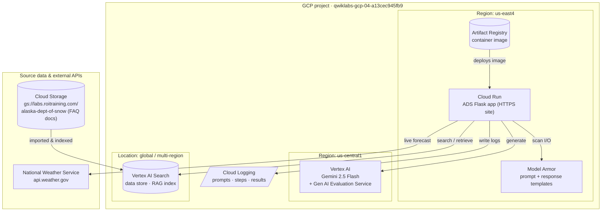
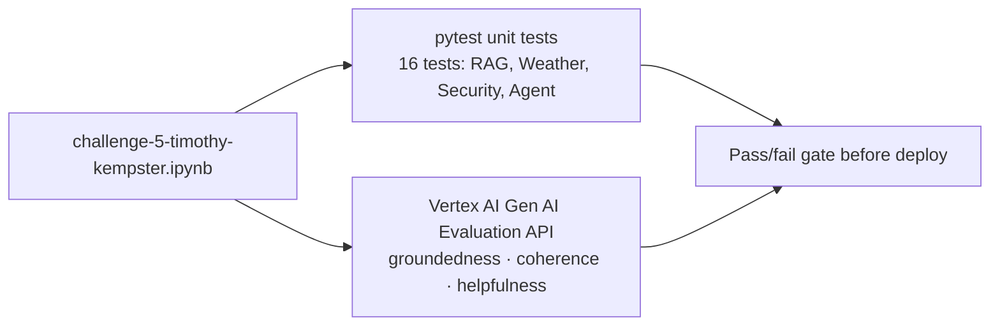

# Challenge 5 — Alaska Department of Snow (ADS) Online Agent: Architecture

This document satisfies Challenge 5, Instruction 1: *"Create a diagram that depicts
your solution to the Alaska Snow Department case study."*

It is the architecture I would walk the ADS leadership team through to address their
questions about **security, privacy, accuracy, and cost** before demonstrating the
working proof of concept (the live Cloud Run app and the notebook in this folder).

---

## Runtime architecture

The request travels left-to-right across the top as a `question`, is verified by Model
Armor (unsafe prompts loop straight back), flows right through the rest of the pipeline to a
drafted answer, is re-checked by Model Armor, and returns to the resident as the answer —
forming a mirrored loop.

## Google Cloud services & deployment topology

Where each piece lives, is deployed, or is stored. Everything except the source bucket and the
National Weather Service API runs inside the workshop project `qwiklabs-gcp-04-a13cec945fb9`.

| Google service | Role in the solution | Location | What is deployed / stored there |
|---|---|---|---|
| **Cloud Run** | Hosts the public chatbot website (Flask app, `ads-agent/`) and runs the orchestrator | `us-east4` | The running container; serves the HTTPS endpoint `alaska-dept-of-snow-…us-east4.run.app` |
| **Artifact Registry** | Container registry for the app image | `us-east4` | The image built from `ads-agent/Dockerfile`, pulled by Cloud Run on deploy |
| **Vertex AI (Gemini)** | Answer generation — `gemini-2.5-flash` | `us-central1` | No persistent storage; model inference endpoint |
| **Vertex AI Gen AI Evaluation Service** | Offline scoring of agent responses (groundedness / coherence / helpfulness) | `us-central1` | Evaluation experiment runs & metrics (created from the notebook) |
| **Vertex AI Search (Discovery Engine)** | RAG retrieval | `global` | The `alaska-dept-of-snow` data store and its document index |
| **Model Armor** | Prompt & response safety filtering | `us-east4` | The `coding-it-prompt-template` (PI/jailbreak) and `coding-it-response-template` (sensitive data) |
| **Cloud Logging** | Audit trail of prompts, pipeline steps, and results | project-wide | Structured log entries written by the app/notebook |
| **Cloud Storage** *(source data — ROI Training bucket)* | Origin of the ADS FAQ documents | multi-region bucket | `*.txt` FAQ docs imported into the Search data store |
| **National Weather Service API** *(external, non-Google)* | Live weather/forecast grounding | public internet | n/a — read-only forecast calls |

---

## Offline quality gates (run in the notebook, not in the request path)

---

## Request flow (numbered)

1. **User → Cloud Run.** A resident asks a question in the browser chat UI served by the
   Flask app on Cloud Run.
2. **Prompt validation (Model Armor).** The prompt is screened for prompt-injection and
   jailbreak attempts. If it matches, the request is blocked and never reaches Gemini.
3. **Tool/API call (optional).** If the question is weather-related, the orchestrator calls
   the **National Weather Service API** for a live forecast for the relevant Alaska city.
4. **RAG retrieval.** The orchestrator queries the **Vertex AI Search data store**
   (Discovery Engine), which indexes the ADS FAQ documents from the Cloud Storage bucket,
   and returns grounded snippets/summary.
5. **Generation (Gemini 2.5 Flash).** The system prompt + retrieved context + live weather
   are sent to Gemini, which is instructed to answer **only** from the provided context and
   to say "I don't know" otherwise.
6. **Response validation (Model Armor).** The draft answer is screened for sensitive data
   before it is returned to the user.
7. **Logging.** Every prompt, pipeline step, and result is written to **Cloud Logging** for
   auditability.

---

## How the architecture answers ADS's concerns

| ADS concern | How the design addresses it |
|---|---|
| **Accuracy / "don't make things up"** | RAG grounding in the ADS data store + a system prompt that forbids fabrication; **groundedness** is measured offline with the Evaluation API. |
| **Security** | Model Armor prompt **and** response filtering (fail-open, logged) plus Gemini's built-in safety filters. |
| **Privacy** | Model Armor sensitive-data (SDP) filter on responses; no resident data is persisted beyond request logs. |
| **Reliability** | Unit tests (pytest) gate the agent's functions; the service exposes a `/health` endpoint for Cloud Run health checks. |
| **Cost (CFO concern)** | Serverless Cloud Run (scales to zero), Gemini 2.5 **Flash** (low cost per token), and a managed Search data store — no always-on infrastructure. |

---

## Mapping to the Challenge 5 requirements

| Requirement | Implementation | Evidence |
|---|---|---|
| Backend data store for RAG | Vertex AI Search / Discovery Engine data store `alaska-dept-of-snow` | `challenge-5-timothy-kempster.ipynb` (data-store setup + verification) |
| Access to backend API functionality | National Weather Service API integration | `get_weather*()` in notebook & `app.py` |
| Unit tests for agent functionality | 16 pytest tests across RAG, Weather, Security, Agent | notebook test cell (16 passed) |
| Evaluation data via Google Evaluation service API | `EvalTask` with groundedness/coherence/helpfulness | notebook evaluation cell |
| Prompt filtering & response validation | Model Armor prompt + response templates | `check_prompt()` / `check_response()` |
| Log all prompts and responses | Python logging → Cloud Logging | `log_step()`; `app-logs-screenshot.png` |
| Agent deployed to a website | Flask app on Cloud Run | `ads-agent/` (Dockerfile + app.py); `screenshot-of-agent.png` (live `*.run.app` URL) |
